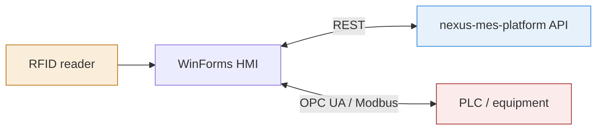
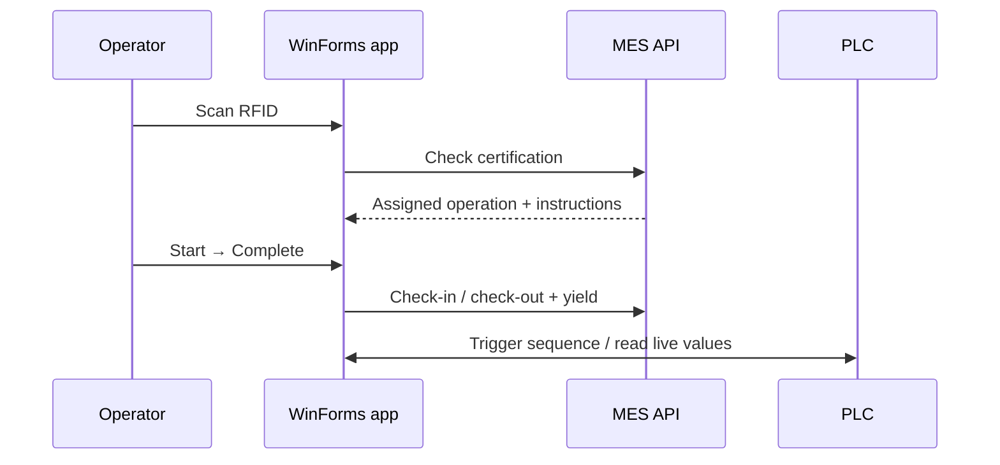

# nexus-mes-hmi

Shop-floor operator interface for [`nexus-mes-platform`](https://github.com/Toqa-Ashraf8/nexus-mes-platform) — a WinForms HMI / SCADA bridge between the MES backend and physical equipment.

Runs on a device tied to one work center. Shows the operator only their current assigned task — nothing else.

## Architecture



## Operator flow



## Scope

Built end-to-end:
- RFID login, work-center-scoped, certification-checked
- Assigned task view (filtered per station)
- Electronic work instructions (image/video, segmented steps)
- Start/Complete workflow with yield & scrap capture
- OPC UA bridge — reads/writes live PLC tags, displayed to the operator in real time

Later phase: Modbus support, in-app quality recording.

## Stack

WinForms (.NET) · custom-drawn controls (`GraphicsPath`) · REST client · OPC UA (via OPC Foundation client library)

## Simulation & testing tools

No physical PLC or RFID hardware available, so the following are used to simulate real equipment during development:

- **Prosys OPC UA Simulation Server** — simulates a PLC's OPC UA server, exposing tags the HMI reads/writes exactly as it would against a real PLC.
- **com0com + Hercules** — com0com creates a virtual COM port pair; Hercules sends serial data through it to simulate RFID card scans for testing the login flow without physical hardware.

## Notable decisions

- **Bridge, not controller** — the app displays live PLC values and sends confirmed MES operations as triggers; it does not implement control logic (e.g. threshold-based decisions) itself, which stays on the PLC.
- **Server-side scoping** — the UI holds no business logic for what an operator is allowed to see; the API decides.
- **ISA-101 theme** — high contrast, large touch targets for factory floor conditions.

## Run

```bash
git clone https://github.com/Toqa-Ashraf8/nexus-mes-hmi.git
# open nexus-mes-hmi.sln, set API base URL, build & run
```
