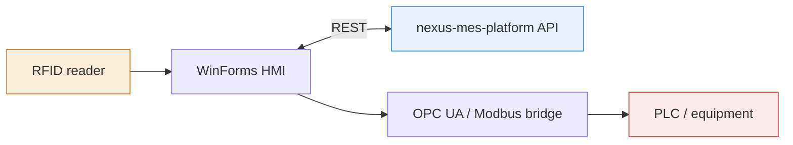
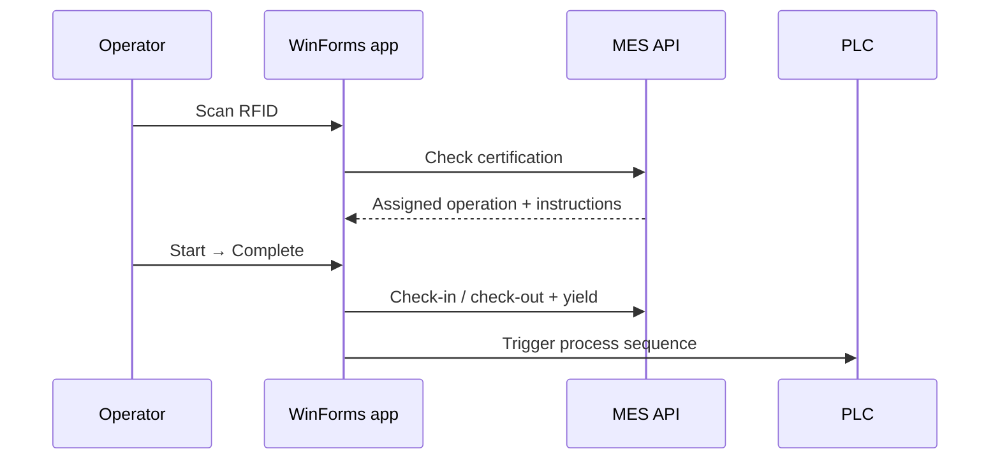

Shop-floor operator interface for [`nexus-mes-platform`](https://github.com/Toqa-Ashraf8/nexus-mes-platform.git) — a WinForms HMI / SCADA bridge between the MES backend and physical equipment.

Runs on a device tied to one work center. Shows the operator only their current assigned task — nothing else.

## Architecture



## Operator flow



## Scope

Built end-to-end:
- RFID login, work-center-scoped, certification-checked
- Assigned task view (filtered per station)
- Electronic work instructions (image/video, segmented steps)
- Start/Complete workflow with yield & scrap capture
- OPC UA / Modbus bridge (simulated)

Later phase: live PLC status readback, in-app quality recording.

## Stack

WinForms (.NET) · custom-drawn controls (`GraphicsPath`) · REST client · OPC UA / Modbus (simulated)

## Notable decisions

- **Bridge, not controller** — translates confirmed MES operations into equipment triggers; no PLC logic lives here.
- **Server-side scoping** — the UI holds no business logic for what an operator is allowed to see; the API decides.
- **ISA-101** — high contrast, large touch targets for factory floor conditions.

## Run

```bash
git clone (https://github.com/Toqa-Ashraf8/nexus-mes-hmi.git)
# open nexus-mes-hmi.sln, set API base URL, build & run
```
